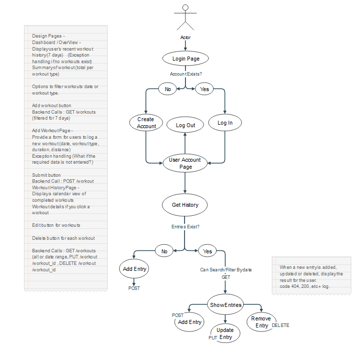
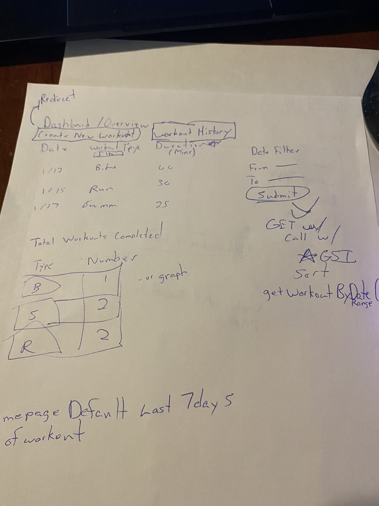
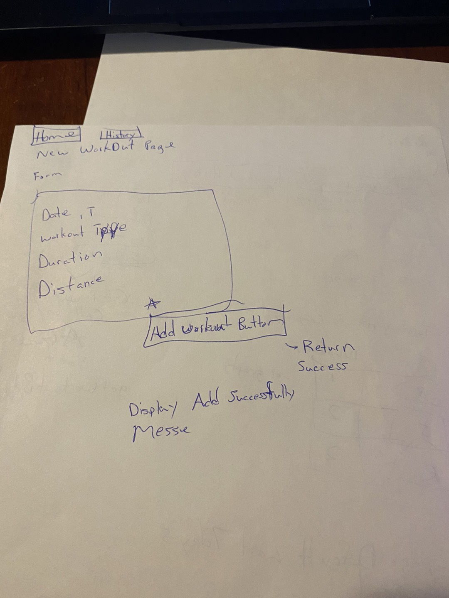

# Fitness Tracker

## 1. Problem Statement

Triathlon Trainer is a service featuring several ways to track your personal fitness routines. Our goal is to design and develop a web-based Java application that is easy to use, reliable, and provides users with the tools they need to achieve their fitness goals. The application should allow users to track their workouts, and view history to help them make data-driven decisions about their health and fitness routines.

## 2. Top Questions to Resolve in Review

1. What are the most important features that users are looking for in a triathlon tracking application?
2. How can we ensure that the user application is friendly to use while still providing useful functionality?
3. What endpoints do we need to create (i.e. PUT, POST, etc.)?

## 3. Use Cases

U1. As a user of Triathlon Tracker, I want to record a triathlon workout, so that I have a saved history of my triathlon workouts.

U2. As a user of Triathlon Tracker, I want confirmation of the workout being recorded, so that I know it was stored successfully.

U3. As a user of Triathlon Tracker, I want to be able to modify a previously recorded workout, so that I can correct mistakes.

U4. As a user of Triathlon Tracker, I want to be able to delete a previously recorded workout, so that I can remove a workout added in error.

U5. 

User would like to view history of workouts by types.

User would like to view workout history between specified dates.

User would like to see a brief workout history by default in the landing page.

***User would like to see a summary of workout (total number of sessions per workout type).


## 4. Project Scope

### 4.1. In Scope

* logging completed workout events 
* retrieving workouts a customer has created
* filtering user data by date 
* filtering user data by workout type

### 4.2. Out of Scope

* let the user see progress over time
* let the user set goals 
* track weight 
* track nutrition

## 5. Proposed Architecture Overview

This initial iteration will provide the minimum viable product (MVP) including creating and retrieving workout data and related statistics for a user.

We will use API Gateway and Lambda to create 4 endpoints (CreateWorkoutLog, GetWorkoutLogs, UpdateWorkoutLog, DeleteWorkoutLog) that will handle the creation and/or retrieval of the corresponding workout information to satisfy our requirements.

We will store completed exercise logs each in a table in DynamoDB.

## 6. API

### 6.1. Public Models

```
// WorkoutLogModel

String customerId
String date  
String workoutType
Integer durationInHours
Integer durationInMin
Integer durationInSeconds
Double distance
```

### 6.2. CreateExerciseLog Endpoint

* Accepts `POST` requests to `/workout-logs`
* Accepts data to create a new WorkoutLog with the required fields (date, exerciseType) with optional fields (durationInHours, durationInMin, durationInSec, distance)


### 6.3. GetWorkoutLogs Endpoint

* Accepts `GET` requests to `/workout-logs/:customerId`
* Accepts a customerId and returns the corresponding list of WorkoutLog objects for the specified customer


### 6.4. EditWorkoutLogs Endpoint

* Accepts `PUT` requests to `/workout-logs/:workoutId`
* Accepts a workoutId and edits existing WorkoutLog for the specified customer

### 6.5. DeleteWorkoutLogs Endpoint

* Accepts `DELETE` requests to `/workout-logs/:workoutId`
* Accepts a workoutId and deletes existing WorkoutLog for the specified customer

## 7. Tables

### 7.1. `workout_logs`

```
String workout_id (Primary Key ) - UUID
String userName(GSI) - user who performed the workout
String date (GSI) - The date when the workout was performed. ( standard format?)
String workoutType(GSI)   // ENUM "RUNNING", "BIKING", "SWIMMING"
Number hours
Number minutes
Number seconds
Number distance -  The distance covered during the workout in kilometers
Indexes -
user_name-index  //  Partition key user_name
workout_type-index //  Partition key  workout_type
date-index // Partition key date
```

## 8. Pages






